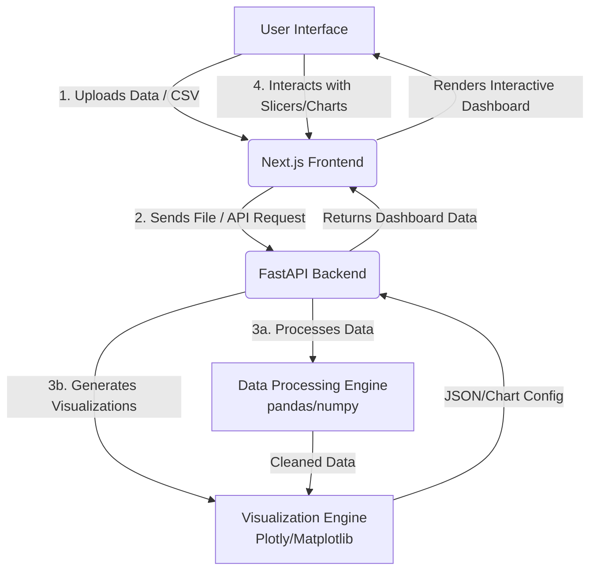

<div align="center">


<br/>

[**Documentation**](#) • [**Demo**](#) • [**Backend API**](#) • [**Frontend**](#)

<br/>

<!-- Tech Stack Badges (Using 'for-the-badge' style for that blocky, premium look) -->
[](https://nextjs.org/)
[](https://reactjs.org/)
[](https://www.typescriptlang.org/)
[](https://www.python.org/)
[](https://fastapi.tiangolo.com/)
[](https://pandas.pydata.org/)
[](https://www.docker.com/)

</div>

---

## 🧠 What is DataMind AI?

DataMind AI is an end-to-end Automated Data Analysis and Business Intelligence platform built to create smarter, faster insights. Most BI tools require complex configurations or coding knowledge; DataMind AI is focused on making data analytics accessible, dynamic, and instantly actionable.

Simply upload your raw data, and DataMind AI automatically processes it, identifies key trends, and generates an interactive, fully-functional dashboard without writing a single line of code.

> 🎥 **Demo Video** (Replace with your actual video or GIF later)
> 
> *Screenshot or Video placeholder showcasing the dashboard in action.*
> 

<br/>

## ✨ Key Features

- **Automated Dashboards**: Upload a CSV and instantly get a tailored dashboard.
- **Global Data Slicers**: Filter your data across all charts simultaneously for deep, interconnected insights.
- **Interactive Chart Explorer**: Dive deep into specific metrics, visualize trends, and export your findings.
- **AI-Driven Processing**: Built-in intelligent data cleaning, type inference, and aggregation.

<br/>

## 🏗️ Architecture & Data Flow



<br/>

## 🚀 Getting Started

### Prerequisites
- Node.js (v18+)
- Python (v3.10+)
- Docker (Optional)

### 1. Clone the repository
```bash
git clone https://github.com/Akshay-Notfound/datamind-analytics.git
cd datamind-analytics
```

*(Add your specific frontend and backend setup instructions here)*

<br/>

## 🛠️ Technologies Used

### Frontend
- **Framework**: Next.js 14 (App Router)
- **Library**: React 18
- **Language**: TypeScript
- **Styling**: Tailwind CSS
- **Charts**: Plotly / Recharts

### Backend
- **Framework**: FastAPI
- **Language**: Python 3.11
- **Data Processing**: Pandas, NumPy
- **Database**: MongoDB (via Motor)

---
<div align="center">
Built by Akshay
</div>
