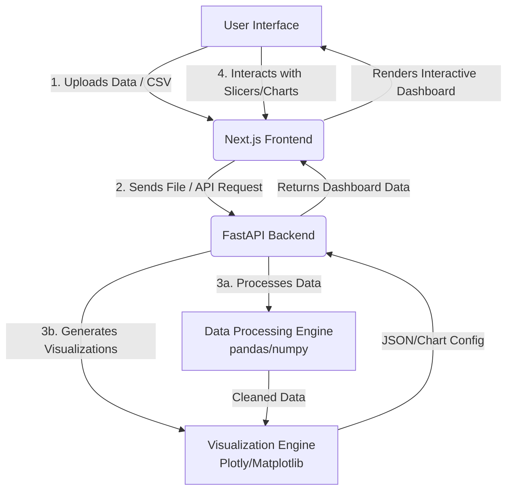

# DataMind AI

DataMind AI is a comprehensive Business Intelligence platform designed to automate data analysis and visualization. Built with a modern React/Next.js frontend and a robust Python backend, it empowers users to explore data, generate interactive dashboards, and uncover valuable insights without needing complex coding skills.

## Architecture & Data Flow

Below is the high-level data flow diagram illustrating how data moves through the DataMind AI platform:

## Tech Stack

- **Frontend:** Next.js, React, TypeScript, Tailwind CSS
- **Backend:** Python, FastAPI, Pandas
- **Containerization:** Docker

## Features

- **Automated Dashboards:** Upload your data and instantly get a tailored dashboard.
- **Global Slicers:** Filter your data across all charts simultaneously.
- **Interactive Data Explorer:** Dive deep into specific metrics and trends.
